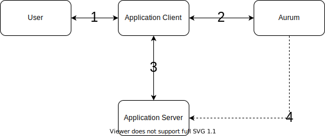

# Authentication flows
Here all authorization flows supported by Aurum will be documented.

# Table Of Contents
1. [Trusted Direct Authentication](#trusted-direct-authentication)

## Trusted Direct Authentication
The Trusted Direct Authentication flow directly uses a user's password to authenticate against Aurum and receive a token.

_**Note**_: This method of authentication is very similar to OAuth's "Resource Owner Password Credentials".

### Considerations
* The **Application Client** must be highly trusted as it directly handles **User** credentials.
  The client should be a first-party app. 

### The flow

1. The **User** enters their credentials into the **Application Client**
2. The **Application Client** sends these credentials to **Aurum** and receives a login and refresh token in return.
3. The **Application Client** uses these tokens to communicate with its own **Application Server** backend. 
4. The **Application Server** can use the public key it obtains from **Aurum**, to verify the validity of the tokens. 

## Untrusted and Indirect Authentication Flows
TODO